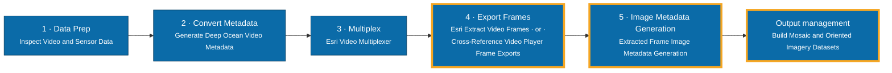

# Ocean Video Tools for ArcGIS Pro

An ArcGIS Pro Python toolbox for turning deep ocean video into documented, analysis-ready
still imagery.

Video from an ROV, an AUV, a towed sled or a drop camera almost never arrives
self-describing. The vehicle records one thing, the navigation log records another, and
the two meet only through a timestamp; often not even reliably through that. Closing the
gap by hand is slow, and it is where the errors get in.

So these five tools do it instead. They tell you whether a video and its telemetry line up
at all, before you have spent an afternoon assuming they do. They build the metadata that
lets telemetry be written into the video itself. They reconstruct the tables that frame
exports need but never carry. And they put standards-compliant metadata onto every frame
that comes out the far end, ready for a mosaic or an oriented imagery dataset.

Most of the work sits in the last two stages: getting frames out of the video, and giving
those frames complete metadata. That is where the standards live (iFDO, BIIGLE, MISB), and
it is the part that otherwise has to be done by hand, dive after dive.

## Workflow

Stages 1–3 are video work; stages 4–5 are image work. The detailed diagram lives in
**[docs/workflow.md](docs/workflow.md)**, along with the artifacts that pass between
tools, the minimum each one needs to run, and the points where you can join the sequence
part-way — which is what usually happens, since few people start at stage 1.

## Repository structure

- `toolbox/OceanVideoToolsForArcGISPro.pyt` — the toolbox; add this to ArcGIS Pro.
- `toolbox/FCT_*_core.py` — the implementation. Each tool is a thin dialog over one core
  module. **These must stay in the same folder as the `.pyt`.**
- `toolbox/*.pyt.xml` — ArcGIS tool metadata sidecars.
- `docs/workflow.md` — the full workflow diagram and per-tool inputs.
- `docs/LESSONS-LEARNED.md` — non-obvious behaviours, for anyone editing the code.
- `docs/DEVELOPMENT.md` — how to validate and release changes.
- `VOCAB-GUIDE.md` — every acronym used here, explained.

## Prerequisites

ArcGIS Pro 3.7 or later. Developed and validated against Pro 3.7.1 (Python 3.13).

Requirements differ per tool. Everything not listed below runs on a default ArcGIS Pro
installation with no extra packages.

| Tool | Requires |
|---|---|
| Extracted Frame Image Metadata Generation | Nothing beyond ArcGIS Pro. Pillow (ships with Pro) is used for embedding metadata *inside* images; if absent, that one option is skipped with a warning |
| Generate Deep Ocean Video Metadata | **Image Analyst extension** |
| Build Mosaic and Oriented Imagery Datasets | **Standard or Advanced licence** — mosaic datasets are not available under Basic |
| Cross-Reference Video Player Frame Exports | Nothing beyond ArcGIS Pro |
| Inspect Video and Sensor Data | Nothing to inspect a **table**. Reading a **video** needs `av` (PyAV) |

> [!NOTE]
> To read video, install PyAV into a **cloned** ArcGIS Pro Python environment — never the
> default `arcgispro-py3`. In Pro: *Project → Package Manager → clone the environment*,
> then install `av` into the clone. *Inspect Video and Sensor Data* remains fully usable
> against a sensor table without it.

## Getting started

1. Download or clone this repository.
2. Copy the whole `toolbox/` folder somewhere permanent. Keep its contents together — the
   toolbox loads its core modules from its own directory.
3. In ArcGIS Pro, open the **Catalog** pane, right-click **Toolboxes → Add Toolbox**, and
   select `OceanVideoToolsForArcGISPro.pyt`.
4. Expand the toolbox. Five tools should appear. A tool shown greyed out is missing a
   licence or extension — see the table above.
5. If you are new to the workflow, run **Inspect Video and Sensor Data** first. It changes
   nothing, and it tells you whether your video and telemetry line up before you invest
   time in the rest.

> [!TIP]
> After replacing the toolbox files, right-click the toolbox in the Catalog pane and
> choose **Refresh**. ArcGIS Pro caches a tool's parameters for the life of a session, so
> a changed dialog may not appear until you do.

## The tools

### Inspect Video and Sensor Data
Read-only, and the sensible place to start. It probes a video, a sensor table, or both,
then writes what it finds as plain text and JSON: time extent, frame rate, resolution,
dropped-frame discontinuities, sampling gaps, per-column statistics, and the question that
matters most — whether the two overlap in time at all. Where a video carries embedded MISB
KLV telemetry it reads that as well, and can write it back out as CSV; that is how you
recover telemetry from a multiplexed video once the original log has gone missing.

### Generate Deep Ocean Video Metadata
Turns a navigation log into the metadata CSV that Esri's *Video Multiplexer* expects. The
log itself only has to supply X, Y and a timestamp. Everything a navigation log never
records — pitch, roll, field of view, near and far distance, height above the seafloor —
comes instead from a selectable **Video Acquisition Profile**, which you can open up and
adjust rather than take on trust. Z is handled however your data allows: name the column,
let it be detected, or give a constant for a log that never recorded one. Anything else in
the table can be routed to any video metadata field through **Additional Field Mapping**.
It will also write a QA track feature class, so the positions can be put on a map and
looked at before you commit to a multiplex.

### Cross-Reference Video Player Frame Exports
Grab frames one at a time from the ArcGIS Pro video player and you get images with no
table at all; the only clue to when each was taken is the elapsed video time on the end of
its filename. This converts that to an absolute timestamp, matches each frame against the
nearest row of a video metadata table, and rebuilds the Frame and Camera Tables the rest
of the workflow depends on. Whatever cannot be matched is kept and flagged. Nothing is
dropped quietly.

### Extracted Frame Image Metadata Generation
The centre of gravity. Metadata goes into the frame images themselves and into sidecars
beside them; every output is optional, so you can take only what your downstream platform
asks for. GDAL PAM (`.aux.xml`), Adobe XMP (`.xmp`), embedded EXIF or PNG tEXt, **iFDO**
JSON, a **BIIGLE** upload CSV, and a JSON manifest recording exactly where each image came
from. It will assemble the lot into a self-contained deliverable folder, and save whatever
you typed as a template for next time.

### Build Mosaic and Oriented Imagery Datasets
Loads the frames and their tables into a mosaic dataset (continuous imagery on a map), an
oriented imagery dataset (each frame inspectable in its true viewing geometry), or both.
Ground footprints are computed from the camera model, so no frame needs georeferencing of
its own.

## Outputs

| Artifact | Produced by | Purpose |
|---|---|---|
| `*_DescriptionReport.txt` / `.json` | Inspect Video and Sensor Data | Human- and machine-readable inspection results |
| `*_VideoMetadataTable.csv` | Generate Deep Ocean Video Metadata | Input to Esri's Video Multiplexer |
| `*_FrameTable.csv` / `*_CameraTable.csv` | Cross-Reference Video Player Frame Exports | The canonical frame/camera schema |
| `*.aux.xml` / `*.xmp` | Extracted Frame Image Metadata Generation | Per-image sidecar metadata |
| `*.ifdo.json` | Extracted Frame Image Metadata Generation | iFDO v2.2.1 metadata |
| `BiigleMetadata.csv` | Extracted Frame Image Metadata Generation | BIIGLE volume upload |
| `SourceManifest.json` | Extracted Frame Image Metadata Generation | Provenance for a delivered folder |
| Mosaic dataset / oriented imagery dataset | Build Mosaic and Oriented Imagery Datasets | Managed geodatabase datasets |

## Notes and operational guidance

**Coordinate systems have to agree between the tools.** *Cross-Reference Video Player
Frame Exports* writes frame positions in whichever output coordinate system you give it;
*Build Mosaic and Oriented Imagery Datasets* then assumes those positions are already in
*its* output coordinate system. Let the two disagree and every footprint lands somewhere
it should not. Both default to WGS 1984 Web Mercator, so leaving both alone is safe.

**The telemetry coordinate system is the one your log is already in**, not one to convert
to. *Generate Deep Ocean Video Metadata* is asking what your X and Y currently mean; leave
it at WGS84 when the log actually holds projected eastings and northings and nothing will
error, it will simply be wrong. This catches more people than anything else here. Tick
*Create Sensor Track Point Feature Class*, put the track on a map, and look at it: five
seconds, and a wrong answer is unmistakable.

**Frames out of video extraction are not really georeferenced.** They generally arrive
with a placeholder world file describing pixel space rather than ground coordinates, and
that is fine — the tools derive each frame's true ground footprint from the camera model
instead. No per-image georeferencing is needed.

**Everything is UTC.** A time carrying no timezone is read as UTC wherever it appears.
Mixing local and UTC between a video and its log is the usual reason a report comes back
insisting the two never overlap.

**Match the Imagery Category to how the camera actually pointed.** It supplies the
defaults used wherever your own data has nothing to say. Leave it at *Nadir* for a
forward-looking camera and footprints will be drawn as though the camera had stared at the
seafloor beneath the vehicle.

**Re-running is safe.** Adding images to an existing mosaic or oriented imagery dataset
adds only what is new, and *Cross-Reference Video Player Frame Exports* skips frames it
has already seen. One caveat: an existing dataset is reused as it stands, so its
coordinate system will not be changed to match this run's settings.

**Several Frame Tables in one folder is normal** for some exports, and supported; each
pair is processed in turn.

**A complete metadata file is not enough to draw a video footprint.** The multiplexer
works the frame corners out from the sensor's position, tilt and field of view against an
elevation surface, so it needs its *Digital Elevation Model* parameter — a layer, or a
single average value such as `-30 meters` for a dive. Esri's own note is that the elevation
must be below the sensor's recorded altitude. Leave it empty and you get a sensor track on
the map and no footprint, with nothing to say why.

**Altitude is measured from mean sea level, so a submerged camera's is negative.** A
navigation log that records height above the seafloor, or depth as a positive number, will
put the camera above the waterline as far as the multiplexer is concerned. Nothing checks
this — the value is valid, just describing somewhere else — so it is worth looking at the
sign of your Z column before wondering why a footprint is missing or misplaced.

## Known issues

- **Metadata embedded inside TIFF files is not confirmed to be visible in ArcGIS Pro's
  raster Properties dialog.** Esri documents that view as populated for recognised sensor
  products, not for generic rasters. The embedded tags are still readable by GDAL-based
  and general-purpose imaging tools. Sidecar output (`.aux.xml`) is unaffected.
- **A value table column's drop-down choices cannot be populated at runtime** in this
  environment, which is why tools report computed values as text for you to copy rather
  than offering them as pick-lists. See [docs/LESSONS-LEARNED.md](docs/LESSONS-LEARNED.md).
- **`Frame Camera` mosaic raster type is not usable with this data.** It requires an
  Omega/Phi/Kappa or Matrix exterior-orientation field that video frame exports do not
  contain. Use the default `Table / Raster Catalog` option.
- **`Sensor Ellipsoid Height Extended` is empty unless you supply it.** No acquisition
  profile can fill it — height above the ellipsoid is not something a camera rig knows.
  Map a column to it, or tick *Telemetry Z is a height above the ellipsoid* when that is
  what your Z genuinely records. Left empty, the multiplexer reports a missing value on
  every row, which is the harmless outcome: a missing-value report costs you nothing,
  whereas a wrong height is read as fact. Supplying the same number as *Sensor True
  Altitude* is the tempting mistake — the two references differ by the geoid separation,
  tens of metres in most of the world, and resolving the ellipsoid figure can place the
  sensor below the elevation surface, where no view ray reaches the ground and no
  footprint is drawn.
- **`Near Distance` and `Camera Height Above Seafloor` do not reach the multiplexer.**
  Convert Video Metadata carries a fixed set of fields and neither is among them. Both are
  still written to the intermediate table, which is where the imagery tools read them.

## Troubleshooting

**A tool is greyed out.** It is missing a licence, an extension, or a Python package. See
the Prerequisites table.

**"No matching column was auto-detected".** The input table uses column names the tools do
not recognise. Either designate the column explicitly where the tool offers a field
parameter, or rename the column in your data. Field matching is case-insensitive but
matches whole names.

**Every row was skipped.** For *Generate Deep Ocean Video Metadata*, a row needs a usable
X, Y **and** a parseable timestamp. Check the timestamp column really holds times, and
that you designated the right one.

**The video's start time could not be determined.** The tool looks for embedded MISB KLV
metadata, then the container's `creation_time` tag, then the earliest timestamp of a
supplied sensor table. If all are absent, provide the *Video Start Time Override*, or
supply the sensor table the video was multiplexed from.

**No overlap between video and sensor table.** Usually a timezone mismatch or genuinely
mismatched files. Compare the reported time ranges in the description report.

**A changed dialog does not appear.** Refresh the toolbox in the Catalog pane; ArcGIS Pro
caches parameters for the session.

## Resources

- [ArcGIS Pro full motion video](https://pro.arcgis.com/en/pro-app/latest/help/data/imagery/full-motion-video-in-arcgis-pro.htm)
- [Oriented imagery in ArcGIS Pro](https://pro.arcgis.com/en/pro-app/latest/help/data/imagery/oriented-imagery-in-arcgis-pro.htm)
- [Mosaic datasets](https://pro.arcgis.com/en/pro-app/latest/help/data/imagery/mosaic-datasets.htm)
- [iFDO specification](https://www.ifdo-schema.org)
- [BIIGLE](https://biigle.de)

## Issues

Found a bug, or want something the toolbox does not do yet? Open an issue.

## Contributing

Contributions are welcome. Please see [CONTRIBUTING.md](CONTRIBUTING.md), and read
[docs/LESSONS-LEARNED.md](docs/LESSONS-LEARNED.md) before changing the toolbox — it
records behaviours that are not obvious from ArcGIS's documentation.

## Acknowledgment

This repository contains code generated or assisted by GitHub Copilot.

## Disclaimer

This is personal work: not an Esri product, not supported by Esri, and not intended for
commercial use. I am sharing it in case it is useful to other people working with deep
ocean video. Use it at your own risk, and check what it produces against data you already
understand before you rely on it.
