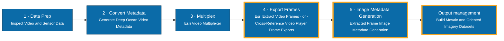

# Ocean Video Tools for ArcGIS Pro

An ArcGIS Pro Python toolbox for turning deep ocean video into documented, analysis-ready
still imagery.

Underwater video from remotely operated vehicles, autonomous vehicles, towed sleds and
drop cameras is usually accompanied by a separate navigation log, and the two are only
loosely connected. These tools close that gap: they check that a video and its telemetry
actually line up, produce the metadata needed to embed telemetry into the video itself,
rebuild the tables that frame exports need, write standards-compliant metadata onto every
extracted frame, and load the result into mosaic and oriented imagery datasets.

The emphasis is on the last two steps — **getting frames out of the video, and giving
those frames complete metadata** — because that is where the standards-compliance work
lives and where most of the manual effort otherwise falls.

## Workflow

Stages 1–3 work with video; stages 4–5 work with still images. See
**[docs/workflow.md](docs/workflow.md)** for the detailed diagram, the artifacts that flow
between tools, minimum inputs per tool, and where you can join the workflow part-way.

## Repository structure

- `toolbox/OceanVideoToolsForArcGISPro.pyt` — the toolbox; add this to ArcGIS Pro.
- `toolbox/FCT_*_core.py` — the implementation. Each tool is a thin dialog over one core
  module. **These must stay in the same folder as the `.pyt`.**
- `toolbox/*.pyt.xml` — ArcGIS tool metadata sidecars.
- `docs/workflow.md` — the full workflow diagram and per-tool inputs.
- `docs/LESSONS-LEARNED.md` — non-obvious behaviours, for anyone editing the code.
- `docs/DEVELOPMENT.md` — how to validate and release changes.
- `VOCAB-GUIDE.md` — every acronym used here, explained.

## Prerequisites

ArcGIS Pro 3.7 or later. Developed and validated against Pro 3.7.1 (Python 3.13).

Requirements differ per tool. Everything not listed below runs on a default ArcGIS Pro
installation with no extra packages.

| Tool | Requires |
|---|---|
| Extracted Frame Image Metadata Generation | Nothing beyond ArcGIS Pro. Pillow (ships with Pro) is used for embedding metadata *inside* images; if absent, that one option is skipped with a warning |
| Generate Deep Ocean Video Metadata | **Image Analyst extension** |
| Build Mosaic and Oriented Imagery Datasets | **Standard or Advanced licence** — mosaic datasets are not available under Basic |
| Cross-Reference Video Player Frame Exports | Nothing beyond ArcGIS Pro |
| Inspect Video and Sensor Data | Nothing to inspect a **table**. Reading a **video** needs `av` (PyAV) |

> [!NOTE]
> To read video, install PyAV into a **cloned** ArcGIS Pro Python environment — never the
> default `arcgispro-py3`. In Pro: *Project → Package Manager → clone the environment*,
> then install `av` into the clone. *Inspect Video and Sensor Data* remains fully usable
> against a sensor table without it.

## Getting started

1. Download or clone this repository.
2. Copy the whole `toolbox/` folder somewhere permanent. Keep its contents together — the
   toolbox loads its core modules from its own directory.
3. In ArcGIS Pro, open the **Catalog** pane, right-click **Toolboxes → Add Toolbox**, and
   select `OceanVideoToolsForArcGISPro.pyt`.
4. Expand the toolbox. Five tools should appear. A tool shown greyed out is missing a
   licence or extension — see the table above.
5. If you are new to the workflow, run **Inspect Video and Sensor Data** first. It changes
   nothing, and it tells you whether your video and telemetry line up before you invest
   time in the rest.

> [!TIP]
> After replacing the toolbox files, right-click the toolbox in the Catalog pane and
> choose **Refresh**. ArcGIS Pro caches a tool's parameters for the life of a session, so
> a changed dialog may not appear until you do.

## The tools

### Inspect Video and Sensor Data
Probes a video and/or a sensor table and writes a plain-text and JSON report: time extent,
frame rate, resolution, dropped-frame discontinuities, sampling gaps, per-column value
statistics, and whether the video and the table overlap in time at all. Reads a video's
own embedded MISB KLV telemetry when present, and can export it as a CSV — recovering the
telemetry from a multiplexed video when the original log is gone. Run it before anything
else; it is read-only.

### Generate Deep Ocean Video Metadata
Builds a metadata CSV ready for Esri's *Video Multiplexer* from a navigation log. Only X,
Y and a timestamp are needed from the log — the camera geometry a navigation log never
records (pitch, roll, field of view, near/far distance, height above seafloor) comes from
a selectable **Video Acquisition Profile** you can inspect and adjust. Optionally writes a
QA track feature class so you can confirm positions on a map before multiplexing.

### Cross-Reference Video Player Frame Exports
Rebuilds a Frame Table and Camera Table for frames grabbed one at a time from the ArcGIS
Pro video player. Those frames carry no table — only a filename ending in the frame's
elapsed video time. This converts that to an absolute timestamp and matches each frame to
the nearest row of a video metadata table, so manually grabbed frames rejoin the same
workflow as automatically extracted ones. Frames with no match are kept and flagged, never
silently dropped.

### Extracted Frame Image Metadata Generation
Writes per-frame metadata into the frame images and into sidecar files beside them.
Outputs, each optional: GDAL PAM (`.aux.xml`), Adobe XMP (`.xmp`), metadata embedded
inside the image (EXIF / PNG tEXt), **iFDO** JSON, a **BIIGLE** upload CSV, and a JSON
manifest recording where every image came from. Can assemble everything into a
self-contained deliverable folder, and save the metadata you type as a reusable template.

### Build Mosaic and Oriented Imagery Datasets
Loads the frames and their tables into a mosaic dataset (continuous imagery on a map)
and/or an oriented imagery dataset (each frame inspectable in its real viewing geometry).
Ground footprints are computed from the camera model, so the frames do not need to be
individually georeferenced.

## Outputs

| Artifact | Produced by | Purpose |
|---|---|---|
| `*_DescriptionReport.txt` / `.json` | Inspect Video and Sensor Data | Human- and machine-readable inspection results |
| `*_VideoMetadataTable.csv` | Generate Deep Ocean Video Metadata | Input to Esri's Video Multiplexer |
| `*_FrameTable.csv` / `*_CameraTable.csv` | Cross-Reference Video Player Frame Exports | The canonical frame/camera schema |
| `*.aux.xml` / `*.xmp` | Extracted Frame Image Metadata Generation | Per-image sidecar metadata |
| `*.ifdo.json` | Extracted Frame Image Metadata Generation | iFDO v2.2.1 metadata |
| `BiigleMetadata.csv` | Extracted Frame Image Metadata Generation | BIIGLE volume upload |
| `SourceManifest.json` | Extracted Frame Image Metadata Generation | Provenance for a delivered folder |
| Mosaic dataset / oriented imagery dataset | Build Mosaic and Oriented Imagery Datasets | Managed geodatabase datasets |

## Notes and operational guidance

**Coordinate systems must agree between tools.** *Cross-Reference Video Player Frame
Exports* writes frame positions in the output coordinate system you choose, and *Build
Mosaic and Oriented Imagery Datasets* assumes those positions are already in *its* output
coordinate system. If the two differ, every footprint lands in the wrong place. Both
default to WGS 1984 Web Mercator.

**Set the telemetry coordinate system correctly.** *Generate Deep Ocean Video Metadata*
asks for the system your log's X/Y are **already in**, not one to convert to. The most
common single mistake is leaving it at WGS84 when the log holds projected eastings and
northings. Tick *Create Sensor Track Point Feature Class* and look at the track on a map —
it takes seconds and catches this immediately.

**Frames from video extraction are not really georeferenced.** They usually carry a
placeholder world file describing pixel space rather than ground coordinates. This is
expected. The tools compute each frame's real ground footprint from the camera model
instead, so no per-image georeferencing is required.

**Timestamps are treated as UTC.** A time with no timezone is assumed to be UTC
throughout. Mixing local and UTC times between a video and its log is a common cause of
zero overlap being reported.

**Choose the Imagery Category to match how the camera pointed.** It supplies the defaults
used wherever your data does not provide a real value. Leaving it at *Nadir* for a
forward-looking camera places footprints as though the camera pointed at the seafloor
beneath the vehicle.

**Re-running is safe.** Adding images to an existing mosaic or oriented imagery dataset
adds only what is new. *Cross-Reference Video Player Frame Exports* processes only frames
it has not seen before. Note that an existing dataset is reused as-is — its coordinate
system is not changed to match new settings.

**More than one Frame Table in a folder is supported**, and is normal for some exports.
Each pair is processed in turn.

## Known issues

- **Metadata embedded inside TIFF files is not confirmed to be visible in ArcGIS Pro's
  raster Properties dialog.** Esri documents that view as populated for recognised sensor
  products, not for generic rasters. The embedded tags are still readable by GDAL-based
  and general-purpose imaging tools. Sidecar output (`.aux.xml`) is unaffected.
- **A value table column's drop-down choices cannot be populated at runtime** in this
  environment, which is why tools report computed values as text for you to copy rather
  than offering them as pick-lists. See [docs/LESSONS-LEARNED.md](docs/LESSONS-LEARNED.md).
- **`Frame Camera` mosaic raster type is not usable with this data.** It requires an
  Omega/Phi/Kappa or Matrix exterior-orientation field that video frame exports do not
  contain. Use the default `Table / Raster Catalog` option.

## Troubleshooting

**A tool is greyed out.** It is missing a licence, an extension, or a Python package. See
the Prerequisites table.

**"No matching column was auto-detected".** The input table uses column names the tools do
not recognise. Either designate the column explicitly where the tool offers a field
parameter, or rename the column in your data. Field matching is case-insensitive but
matches whole names.

**Every row was skipped.** For *Generate Deep Ocean Video Metadata*, a row needs a usable
X, Y **and** a parseable timestamp. Check the timestamp column really holds times, and
that you designated the right one.

**The video's start time could not be determined.** The tool looks for embedded MISB KLV
metadata, then the container's `creation_time` tag, then the earliest timestamp of a
supplied sensor table. If all are absent, provide the *Video Start Time Override*, or
supply the sensor table the video was multiplexed from.

**No overlap between video and sensor table.** Usually a timezone mismatch or genuinely
mismatched files. Compare the reported time ranges in the description report.

**A changed dialog does not appear.** Refresh the toolbox in the Catalog pane; ArcGIS Pro
caches parameters for the session.

## Resources

- [ArcGIS Pro full motion video](https://pro.arcgis.com/en/pro-app/latest/help/data/imagery/full-motion-video-in-arcgis-pro.htm)
- [Oriented imagery in ArcGIS Pro](https://pro.arcgis.com/en/pro-app/latest/help/data/imagery/oriented-imagery-in-arcgis-pro.htm)
- [Mosaic datasets](https://pro.arcgis.com/en/pro-app/latest/help/data/imagery/mosaic-datasets.htm)
- [iFDO specification](https://www.ifdo-schema.org)
- [BIIGLE](https://biigle.de)

## Issues

Find a bug or want to request a new feature? Please let us know by submitting an issue.

## Contributing

Contributions are welcome. Please see [CONTRIBUTING.md](CONTRIBUTING.md), and read
[docs/LESSONS-LEARNED.md](docs/LESSONS-LEARNED.md) before changing the toolbox — it
records behaviours that are not obvious from ArcGIS's documentation.

## Acknowledgment

This repository contains code generated or assisted by GitHub Copilot.

## Disclaimer

This is personal work. It is not an official Esri product, it is not supported by Esri,
and it is not intended for commercial use. It is shared in the hope that it is useful to
others working with deep ocean video. Use it at your own risk, and validate its output
against your own data before relying on it.
