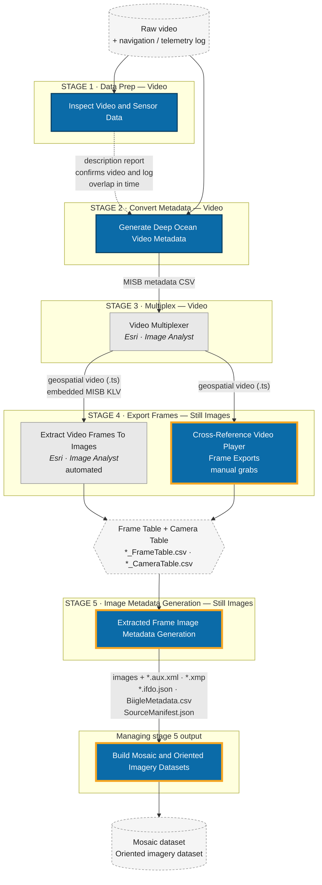

# Deep Ocean Video Workflow

The toolbox follows a five-stage workflow. Video is prepared, its metadata converted and
multiplexed into the video itself, frames are exported as still images, and each still
image is given its own metadata. The tools in this repository exist mainly to support
**stages 4 and 5** — getting frames out of the video and giving those frames complete,
standards-compliant metadata — with **Build Mosaic and Oriented Imagery Datasets**
managing what stage 5 produces.

Stages 1–3 work with **video**. Stages 4–5 work with **still images**.

Tools in **blue** are in this repository; tools in **grey** ship with ArcGIS Pro. The
**orange-outlined** tools are the ones this toolbox primarily exists to provide.

## Why both stage 4 paths converge

Frames reach stage 5 by one of two routes, and both produce the **same Frame Table and
Camera Table CSV pair**:

- **Automated** — Esri's *Extract Video Frames To Images* samples the video and writes
  the table pair itself.
- **Manual** — frames grabbed one at a time from the ArcGIS Pro video player arrive with
  no table at all, only a filename ending in the frame's elapsed time in milliseconds.
  *Cross-Reference Video Player Frame Exports* reconstructs the table pair by matching
  each frame's elapsed time against a video metadata table.

Because both routes end at the same schema, everything downstream — stage 5 and the
mosaic/oriented imagery datasets — works identically no matter how the frames were
obtained. That convergence is the single most important idea in this workflow.

## Minimum inputs per tool

The smallest set of inputs that will make each tool run.

| Tool | Minimum input | Also required |
|---|---|---|
| Inspect Video and Sensor Data | A video **or** a sensor table (at least one) | Output folder and report name |
| Generate Deep Ocean Video Metadata | Telemetry table with X, Y and a timestamp | Output folder, output name, a Video Acquisition Profile. **Image Analyst extension** |
| Cross-Reference Video Player Frame Exports | Folder of `..._<milliseconds>.<ext>` frames + a video metadata table | Output table name |
| Extracted Frame Image Metadata Generation | Folder containing frame images and a `*_FrameTable.csv` | At least one output format selected |
| Build Mosaic and Oriented Imagery Datasets | Folder with frame images and a Frame/Camera Table pair | Output geodatabase, dataset base name. **Standard or Advanced licence** |

## Entry points

You do not have to start at stage 1.

- **Already have a multiplexed video?** Start at stage 4.
- **Already have extracted frames and their Frame/Camera Tables?** Start at stage 5.
- **Only have still images with no tables?** Use *Cross-Reference Video Player Frame
  Exports* to build the tables first.
- **Just want to check whether a video and a telemetry log line up?** Run *Inspect Video
  and Sensor Data* on its own — it needs nothing else, and with a table alone it needs no
  extra Python packages.

<!--
  Rule-based frame extraction (an alternative automated path at stage 4, driven by
  sampling interval plus UTC windows plus sensor-value constraints) is developed in this
  project but not part of this release, because it depends on a third-party library.
  To publish it, build with `--include-deepframex` and restore this branch:

      subgraph S4b["STAGE 4 · automated, rule-based"]
          T5["Extract Video Frames by Rules"]
      end
      E1 -- "geospatial video (.ts)" --> T5
      T5 --> FCT
      T6 -. "report pre-seeds the rules" .-> T5
-->
